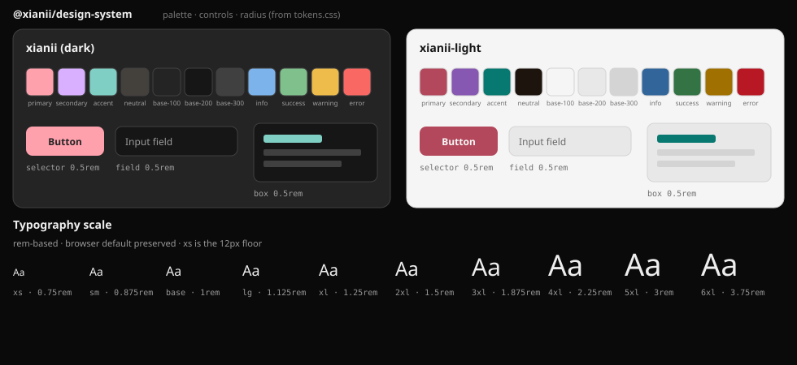

# @xianii/design-system

Framework-agnostic **CSS theme tokens** for the Xianii brand. No UI components, no framework lock-in.

Optional adapters bridge the same tokens into Tailwind CSS v4 and daisyUI v5. Svelte + daisyUI are used only by the demo app in this repo — not by this package.

## Installation

```bash
pnpm add @xianii/design-system
```

## Usage

### Default: CSS variables only

```css
@import "@xianii/design-system";
/* or: @import "@xianii/design-system/tokens.css"; */
```

```html
<html data-theme="xianii">
  <!-- or data-theme="xianii-light" -->
  <button style="background: var(--color-primary); color: var(--color-primary-content)">
    Click Me
  </button>
</html>
```

Works with any stack (vanilla, React, Vue, Svelte, etc.).

### Optional: Tailwind v4 adapter

```bash
pnpm add tailwindcss@^4 @tailwindcss/vite
```

```css
@import "tailwindcss";
@import "@xianii/design-system/tailwind.css";
```

Then use utilities: `bg-primary`, `text-base-content`, `font-sans`, `animate-float`, etc.

### Optional: daisyUI v5 adapter

```bash
pnpm add tailwindcss@^4 daisyui@^5 @tailwindcss/vite
```

```css
@import "tailwindcss";
@plugin "daisyui";
@import "@xianii/design-system/daisyui.css";
@import "@xianii/design-system/tailwind.css"; /* fonts / animate utilities */
```

Or the convenience entry (daisyUI themes + Tailwind `@theme`):

```css
@import "tailwindcss";
@plugin "daisyui";
@import "@xianii/design-system/theme.css";
```

```html
<button class="btn btn-primary">Click Me</button>
```

## Package exports

| Export | What it is |
|--------|------------|
| `@xianii/design-system` / `tokens.css` | Pure CSS custom properties (default) |
| `tailwind.css` | Tailwind `@theme inline` bridge |
| `daisyui.css` | daisyUI `@plugin "daisyui/theme"` themes |
| `theme.css` | Convenience: daisyUI + Tailwind adapters |

`tailwindcss` and `daisyui` are **optional** peer dependencies — required only when using the matching adapter.

## Theme tokens



Themes: `data-theme="xianii"` (dark, default) and `data-theme="xianii-light"`.

| Token | Usage |
|-------|-------|
| `--color-primary` | Primary actions, links |
| `--color-secondary` | Secondary actions |
| `--color-accent` | Highlights |
| `--color-neutral` | Neutral surfaces |
| `--color-base-100` / `200` / `300` | Surfaces |
| `--color-base-content` | Default text on base |
| `--color-*-content` | Foreground on each role color |
| `--color-info` / `success` / `warning` / `error` | Status |
| `--font-sans` / `serif` / `mono` | Typography |
| `--radius-selector` / `field` / `box` | Radii (button / input / card) |

After changing `tokens.css`, regenerate the preview locally (not CI):

```bash
pnpm generate:preview
```

## For AI Agents

1. Install: `pnpm add @xianii/design-system`
2. Default: `@import "@xianii/design-system";` and use `var(--color-*)` / `data-theme`
3. Only add Tailwind/daisyUI adapters if the host project already uses those tools
4. Do not assume Svelte or daisyUI component classes exist — this package ships tokens, not components

## License

MIT
